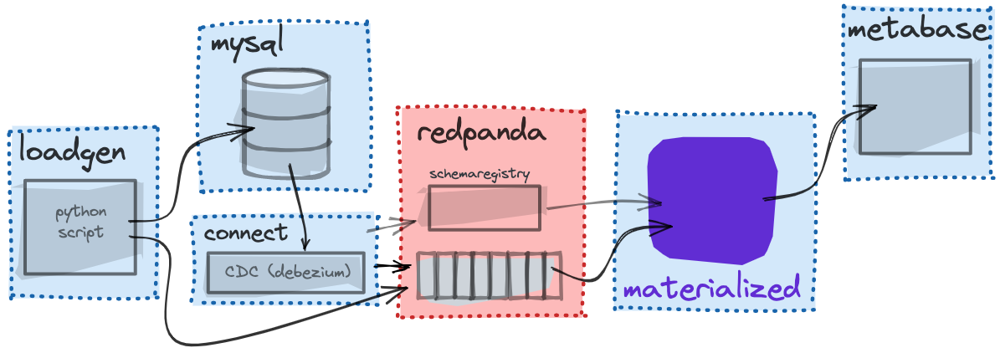

# Redpanda + Materialize Demo

This is a variation of the [ecommerce Materialize demo](https://github.com/MaterializeInc/ecommerce-demo), illustrating how it could be extended so that you could use Materialize to send out abandoned cart notifications.



**NOTE:** For context on what is happening in the initial ecommerce demo, and initial setup instructions, see the [README](https://github.com/MaterializeInc/ecommerce-demo#readme).

## Running Redpanda + Materialize Stack

You'll need to have [docker and docker-compose installed](https://materialize.com/docs/third-party/docker) before getting started.

1. Clone this repo and navigate to the directory by running:

```shell session
git clone https://github.com/bobbyiliev/materialize-tutorials.git
cd materialize-tutorials/mz-abandoned-cart
```

2. Build the necessary images by running:

```shell session
docker-compose build
```

3. First let's run the Redpanda and Debezium services:

```shell session
docker-compose up -d redpanda debezium
```

4. After giving it a few seconds, let's bring up the rest of the Docker Compose containers in the background:

```shell session
docker-compose up -d
```

> Note: **This may take several minutes to complete the first time you run it.** If all goes well, you'll have everything running in their own containers, with Debezium configured to ship changes from MySQL into Redpanda.


5. Confirm that everything is running as expected:

```shell session
docker stats
```

6. Log in to MySQL to confirm that tables are created and seeded:

```shell session
docker-compose exec mysql /bin/bash

mysql -u root -pdebezium -h 127.0.0.1 shop

SHOW TABLES;

SELECT * FROM purchases LIMIT 1;
```

6. Exec in to the redpanda container to look around using redpanda's amazing `rpk` CLI.

```shell session
docker-compose exec redpanda /bin/bash

rpk debug info

rpk topic list

rpk topic create dd_flagged_profiles

rpk topic consume pageviews
```

You should see a live feed of JSON formatted pageview kafka messages:

```
{
    "key": "3290",
    "message": "{\"user_id\": 3290, \"url\": \"/products/257\", \"channel\": \"social\", \"received_at\": 1634651213}",
    "partition": 0,
    "offset": 21529,
    "size": 89,
    "timestamp": "2021-10-19T13:46:53.15Z"
}
```


7. Launch the Materialize CLI.

```shell session
docker-compose run mzcli
```

    _(This is just a shortcut to a docker container with postgres-client pre-installed, if you already have psql you could run `psql -U materialize -h localhost -p 6875 materialize`)_

8. Now that you're in the Materialize CLI, define all of the tables in `mysql.shop` as Kafka sources:

```sql
CREATE SOURCE purchases
FROM KAFKA BROKER 'redpanda:9092' TOPIC 'mysql.shop.purchases'
FORMAT AVRO USING CONFLUENT SCHEMA REGISTRY 'http://redpanda:8081'
ENVELOPE DEBEZIUM;

CREATE SOURCE items
FROM KAFKA BROKER 'redpanda:9092' TOPIC 'mysql.shop.items'
FORMAT AVRO USING CONFLUENT SCHEMA REGISTRY 'http://redpanda:8081'
ENVELOPE DEBEZIUM;

CREATE SOURCE users
FROM KAFKA BROKER 'redpanda:9092' TOPIC 'mysql.shop.users'
FORMAT AVRO USING CONFLUENT SCHEMA REGISTRY 'http://redpanda:8081'
ENVELOPE DEBEZIUM;

CREATE SOURCE json_pageviews
FROM KAFKA BROKER 'redpanda:9092' TOPIC 'pageviews'
FORMAT BYTES;
```

Because the first three sources are pulling message schema data from the registry, materialize knows the column types to use for each attribute. The last source is a JSON-formatted source for the pageviews.

Now if you run `SHOW SOURCES;` in the CLI, you should see the four sources we created:

```
materialize=> SHOW SOURCES;
    name
----------------
items
json_pageviews
purchases
users
(4 rows)

materialize=>
```

9. Next we will create a NON-materialized View, you can almost think of this as a reusable template to be used in other materialized view.

```sql
CREATE VIEW pageview_stg AS
    SELECT
        *,
        regexp_match(url, '/(products|profiles)/')[1] AS pageview_type,
        (regexp_match(url, '/(?:products|profiles)/(\d+)')[1])::INT AS target_id
    FROM (
        SELECT
            (data->'user_id')::INT AS user_id,
            data->>'url' AS url,
            data->>'channel' AS channel,
            (data->>'received_at')::double AS received_at
        FROM (
            SELECT CAST(data AS jsonb) AS data
            FROM (
                SELECT convert_from(data, 'utf8') AS data
                FROM json_pageviews
            )
        )
    );
```

10. **Analytical Views:** Let's create a couple analytical views to get a feel for how it works.


   We can start simple with a materialized view that aggregates all users that have not completed a purchase:

```sql
CREATE MATERIALIZED VIEW incomplate_purchases AS
    SELECT
        users.id AS user_id,
        users.email AS email,
        users.is_vip AS is_vip,
        purchases.item_id,
        purchases.status,
        purchases.quantity,
        purchases.purchase_price,
        purchases.created_at,
        purchases.updated_at
    FROM users
    JOIN purchases ON purchases.user_id = users.id
    WHERE purchases.status = 0;
```

Let's also create a materialized view that contains all users that are no longer browsing the site:

> For the demo we would use 3 minutes as the idle time. But in a real world we could use a larger value like 30 minutes for example.

```sql
CREATE MATERIALIZED VIEW inactive_users_last_3_mins AS
    SELECT
        user_id,
        date_trunc('minute', to_timestamp(received_at)) as visited_at_minute
    FROM pageview_stg
    WHERE
    mz_logical_timestamp() >= (received_at*1000 + 180000)::numeric
    GROUP BY 1,2;
```

We can check that it's working by querying the view:

```sql
SELECT * FROM inactive_users_last_3_mins LIMIT 5;
```

Or we can even check that it's incrementally updating by exiting out of materialize and running a watch command on that query:

```bash session
watch -n1 "psql -c 'SELECT * FROM inactive_users_last_3_mins LIMIT 5;' -U materialize -h localhost -p 6875"
```


11.  **Views for User-Facing Data:**

Redpanda will often be used in building rich data-intensive applications, let's try creating a view meant to power something like the "Who has viewed your profile" feature on Linkedin:

Notify user inactive users with incomplete orders:
```sql
CREATE MATERIALIZED VIEW abandoned_cart2 AS
    SELECT
        incomplate_purchases.user_id,
        incomplate_purchases.email,
        incomplate_purchases.item_id,
        incomplate_purchases.purchase_price,
        incomplate_purchases.status
    FROM incomplate_purchases
    JOIN inactive_users_last_3_mins ON inactive_users_last_3_mins.user_id = incomplate_purchases.user_id
    GROUP BY 1, 2, 3, 4, 5;
```

We can check it with:

```sql
SELECT * FROM abandoned_cart LIMIT 5;
```

and confirm that this is the data we could use to send out notifications to those users who have not completed their orders yet.

12. Sink data back out to Redpanda:

Let's now create a sink to stream the updates to this `abandoned_cart` view back out to redpanda:

```sql
CREATE SINK abandoned_cart_sink
    FROM abandoned_cart
    INTO KAFKA BROKER 'redpanda:9092' TOPIC 'users-incomplete-orders-sink'
    WITH (reuse_topic=true, consistency_topic='users-incomplete-orders-sink-consistency')
    FORMAT AVRO USING
    CONFLUENT SCHEMA REGISTRY 'http://redpanda:8081';
```

This is a bit more complex because it is an `exactly-once` sink. This means that across materialize restarts, it will never output the same update more than once.

We won't be able to preview the results with `rpk` because it's AVRO formatted. But we can actually stream it BACK into Materialize to confirm the format!

```sql
CREATE MATERIALIZED SOURCE cart_test
FROM KAFKA BROKER 'redpanda:9092' TOPIC 'users-incomplete-orders-sink'
FORMAT AVRO USING CONFLUENT SCHEMA REGISTRY 'http://redpanda:8081';

SELECT * FROM cart_test LIMIT 1;
```

## Conclusion

You now have materialize doing real-time materialized views on a changefeed from a database and pageview events from Redpanda.

You can take this a step further and start sending out notifications based on the information in the `users-incomplete-orders-sink` topic.

In metabase, you have the ability to create dashboards and reports using the real-time data.

You have a lot of infrastructure running in docker containers, don't forget to run `docker-compose down` to shut everything down!